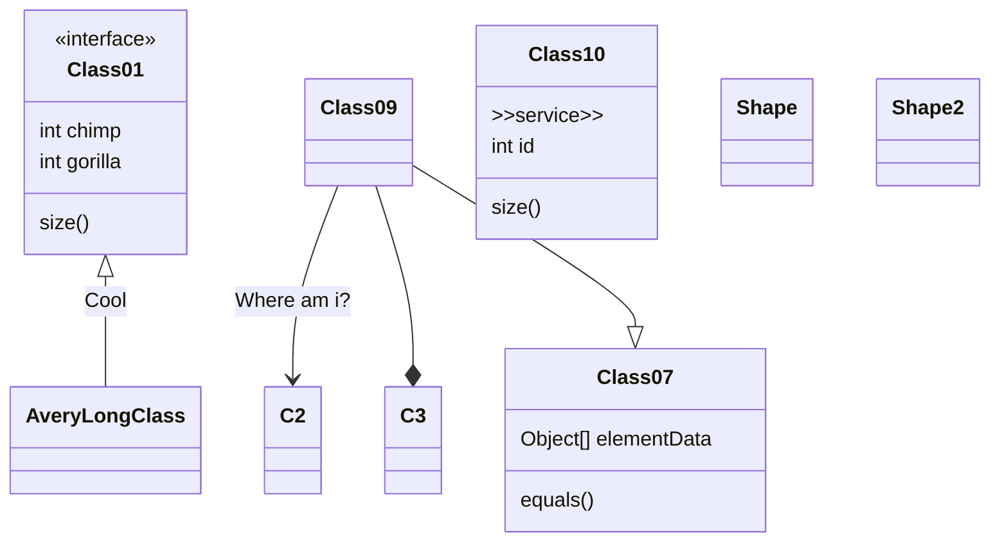
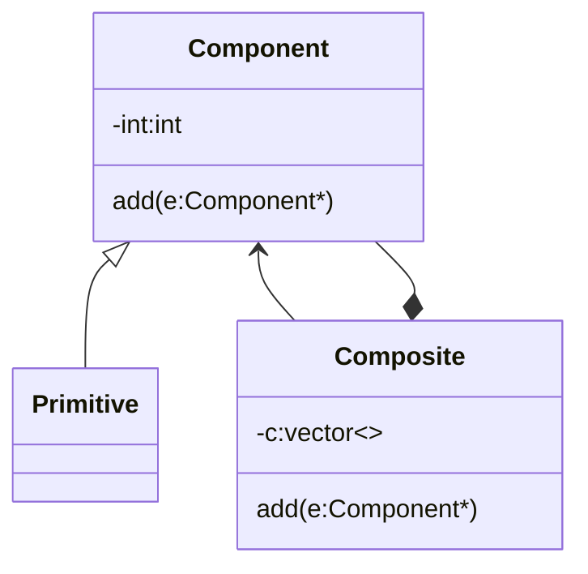

# 写在前面

```mermaid
classDiagram
    Class01 <|-- AveryLongClass : Cool
    <<interface>> Class01
    Class09 --> C2 : Where am i?
    Class09 --* C3
    Class09 --|> Class07
    Class07 : equals()
    Class07 : Object[] elementData
    Class01 : size()
    Class01 : int chimp
    Class01 : int gorilla
    class Class10 {
        >>service>>
        int id
        size()
    }
    
%%classDiagram
    class Shape
    link Shape "https://www.github.com" "This is a tooltip for a link"
    class Shape2
    click Shape2 href "https://www.github.com" "This is a tooltip for a link"
    
```

```mermaid
classDiagram
direction TB
    class Component{
     -int:int
     add(e:Component*)
    } 
    class Composite{
     -c:vector<<Component*>>
     add(e:Component*)
    } 
    class Primitive{
    
    }
    Component    <|-- Primitive
    Component    <-- Composite
    Composite     *-- Component
```

