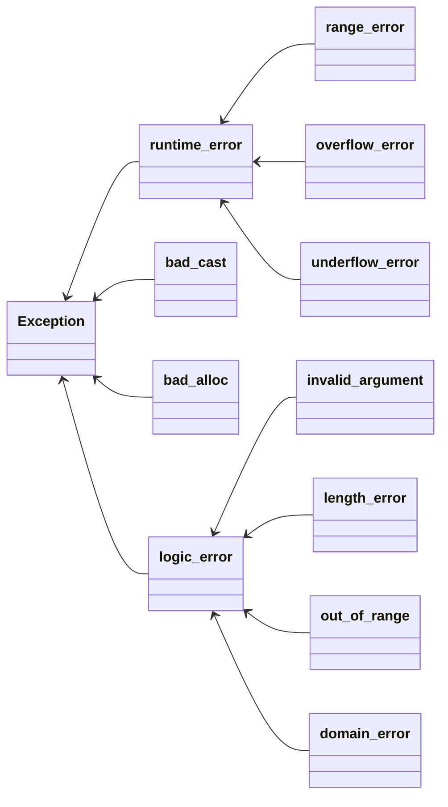

# 写在前面

简单总结一下C++异常处理部分(Exception).

>   异常只是C++为了处理错误提出的一种解决方案, 并不是唯一的一种. 

# 异常处理

## 特点

1.   异常处理的流程完全独立
2.   异常不能被忽略, 必须被处理
3.   异常可以用在错误码无法使用的场合中

## 错误类型的继承关系

>   总结自CPP Primer第五版



## 判断什么时候使用异常

1.   不允许被忽略的错误
2.   极少数情况下才会发生的错误
3.   严重影响代码的正常运行流程, 很难恢复到正常状态的错误
4.   无法本地处理. 必须穿透"调用栈", 传递到上层才能被处理的错误.

例子:

-   构造函数, 内部初始化失败, 则后面的逻辑也无法进行, 这时候可以用异常处理. 
-   读写文件, 使用异常判断文件权限问题的错误
-   socket编程, 不要使用异常(因为经常出现网络问题, 使用异常降低性能)

# 代码示例

## 继承runtime_error

```cpp
class my_exception : public std::runtime_error {
public:
    using this_type = my_exception;
    using super_type = std::runtime_error;

public:
    my_exception(const char* msg) : super_type(msg) {}
    /* my_exception() = default; */
    ~my_exception() = default;

private:
    int code = 0;
};
```


## 封装throw

```cpp
[[noreturn]] void raise(const char* msg) { throw my_exception(msg); }
```


## catch语句块

>   异常只能按照catch块在代码中的 顺序依次匹配, 而不是去找最佳匹配

建议: 只使用一个catch块, 例如:

```cpp
try {
    raise("error occuerd");
} catch (const exception& e) {
    cout << e.what() << endl; // what()是exception类的虚函数
}
```


## function-try

```cpp
void fun()
    try {
        ...
    } catch (...) {
        ...
    }
```

仍然用上面的例子:

```cpp
void t2() try { raise("error occuerd"); } catch (const exception& e) {
    cout << e.what() << endl;
}
```

优点: 

1.   捕获函数执行过程中所有可能的异常
2.   少了一层缩进, 逻辑清晰


## 使用noexcept

这个关键字专门用来修饰函数, 用来告诉编译器被修饰的函数不会抛出异常.

```cpp
void func_noexcept() noexcept { cout << "noexcept\n"; }
```

只是一个声明, 就算函数体内部抛出了异常, 也是可以的. 

```cpp
void func_noexcept() noexcept {
    cout << "noexcept\n";
    throw(1);
}
// output:
//terminate called after throwing an instance of 'int'
```


# 特殊异常的处理方法

下面介绍一些实际使用中用到的C++异常, 例如在力扣中使用异常来避免使用判断语句(虽然理想很丰满), 以及


## 数组越界异常

先来看这样一道题:

[剑指 Offer 64. 求1+2+…+n - 力扣（LeetCode）](https://leetcode.cn/problems/qiu-12n-lcof/);

使用Python的话, 可以这样写:

```python
class Solution:
    def sumNums(self, n: int) -> int:
        try:
            a = [0]
            return a[n - 1] + n
        except Exception:
            return n + self.sumNums(n - 1)
```

那么神通广大的C++可以这样做吗? 答案是:No..(并且就算这样可以也不是最优解)

来看看如果用C++捕获异常的情况:

```cpp
class Solution {
public:
    int sumNums(int n) {
        int a[1]{0};
        try {
            if (n - 1 >= 1) throw 1;
            return a[n - 1] + n;
        } catch (int) { return n + sumNums(n - 1); }
    }
};
```

没错, 必须手动判断然后通过`throw`抛出异常, 是不是很逆天... 并不智能. 


## 空指针异常

这里是另一道力扣题:

[141. 环形链表 - 力扣（LeetCode）](https://leetcode.cn/problems/linked-list-cycle/);

当然快慢指针是最快的方法, 不过判断指针的异常情况也可以, 例如Python:

```python
# Definition for singly-linked list.
# class ListNode:
#     def __init__(self, x):
#         self.val = x
#         self.next = None

class Solution:
    def hasCycle(self, head: Optional[ListNode]) -> bool:
        s=f=head
        while 1:
            try:
                s=s.next
                f=f.next.next
            except Exception as e:
                return False
            if s==f:
                return True
```

但是, 用C++来直接捕获空指针异常就是不可能的, 只能手动加判断然后抛出异常: 

```cpp
/**
 * Definition for singly-linked list.
 * struct ListNode {
 *     int val;
 *     ListNode *next;
 *     ListNode(int x) : val(x), next(NULL) {}
 * };
 */
class Solution {
public:
    bool hasCycle(ListNode *head) {
        auto fast = head, slow = head;
        while (1) {
            try {
                if (!fast || !fast->next) throw 1;
                fast = fast->next->next;
                slow = slow->next;
            } catch (int) { return false; }
            if (fast == slow) return true;
        }
    }
};
```

不过, 这样倒是也好, 不会惯坏C++程序员, 像这种错误会引起`core dump`, 还是尽早处理了好, 别等到实际运行的时候才去处理. 

>   [c++ - How to catch the null pointer exception? - Stack Overflow](https://stackoverflow.com/questions/1823721/how-to-catch-the-null-pointer-exception);
