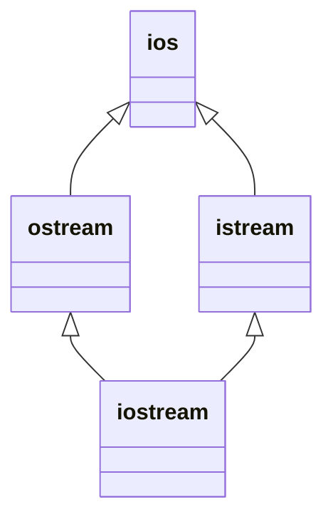
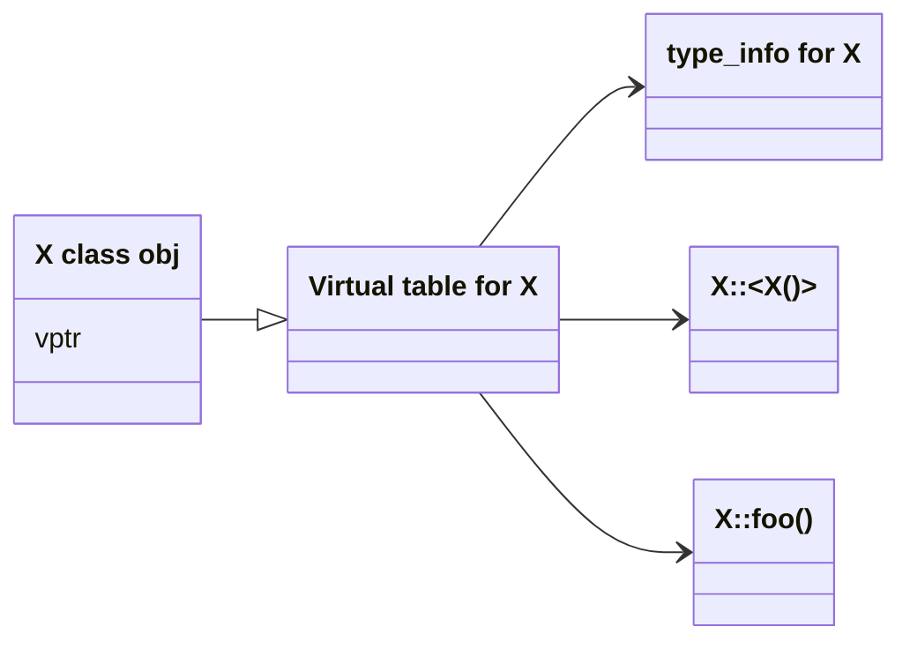

# 写在前面

这部分内容主要是一个引子, 包含以下经典的问题, 介绍了 C++在对象模型这方面的设计与演进.

- 数据成员和成员函数的内存布局
- 虚函数的内存布局
- 继承模型, 父类和子类的内存布局
-   

# C++对象模型

两种类数据成员:

- 静态.
- 非静态

三种类成员函数:

- 静态
- 非静态
- 虚

## 几种模型

- 简单对象模型: 一个对象是一系列的槽(slot), 每个 slot 指向一个成员, 成员按照其声明顺序各被指定一个 slot, 每个成员(数据/函数)都有自己的 slot;

- 表格驱动对象模型: 把所有与成员相关的信息抽取出来, 放在一个数据成员表和成员函数表中, 类对象本身内含指向这两个表格的指针. 成员函数表是一系列 slots, 每一个 slot 指出一个成员函数, 数据成员表直接持有数据本身.

- C++对象模型: 非静态数据成员被配置在每一个类对象之内, 静态数据成员被存放在个别的类对象之外, 静态和非静态成员函数被放在个别类对象之外, 虚函数有两个步骤支持:

  1.  每一个类产生出一堆指向虚函数的指针, 放在表格中, 称为虚表(Virtual table, vtbl)

  2.  每一个类对象被安插一个指针, 指向相关的虚表, 这个指针被称为虚指针(Virtual pointer, vptr)

      > 虚指针的设定(getting)和重置(setting) 都由每一个类的构造函数/析构函数/拷贝赋值运算符自动完成.
      >
      > 每一个类所关联的`type_info` 对象(RTTI 支持)也经由虚表被指出来, 放在表格的第一个 slot 中.

## 类继承

- 单继承

  ```cpp
  class B{};
  class A: public B{};
  class C: public A{};
  ```

- 多继承:

  ```cpp
  class iostream:
      public istream,
      public ostream {};
  ```

- 虚继承:
  ```cpp
  class ostream : virtual public ios {};
  class istream : virtual public ios {};
  ```



- 在虚继承下, 基类不管在继承链中被派生多少次, 永远只会存在一个实例(subobject)

C++最初采用的继承木星不运用任何间接性, 积累子对象的数据成员被直接放置于派生类对象中, 这提供了对基类成员最紧凑而且最有效率的存取, 缺点是积累的任何改变(增加, 移除或者改变类型等)都使得所有用到此基类或者其派生类的对象的对象重新编译.

C++2.0(C++11)之后导入了虚基类, 需要一些间接的基类表现方法, 虚基类的原始模型实在类对象中为诶一个有关联的虚基类加上一个指针. 其他演化出来的模型则要不是导入一个虚基类表, 就是扩充原来已经存在的虚表, 以便维护每一个虚基类的位置

## 对象模型如何影响程序

这里给出一个例子, 就是基本的类+三种成员函数

```cpp
class X { // 可能的实现
    X() { ... }
    virtual ~X() { ... }
    virtual void foo() { ... }
};

X foobar() { // 函数调用
    X xx;
    X* px = new X;
    // foo : virtual func
    xx.foo();
    px->foo();

    delete px;
    return xx;
}
```

一种可能的(编译)转化为:

```cpp
void foobar( X &_result) {
    // call ctor
    // _result 用来取代局部变量 xx,
    // 因为编译实际上并不会使用程序中实际定义的变量名
    _result.X::X();

    // 扩展动态内存分配
    px = _new(sizeof(X)); // 实质上是 malloc 调用
    if (px != 0) // 内存分配成功
        px->X::X(); // call ctor

    // 扩展 xx.foo() 但不使用虚机制
    // 以 _result 取代 xx, 直接调用
    foo(&_result); // 调用者地址传入成员函数(实际的编译结果)

    // 使用虚机制扩展 px->foo()
    (*px->vtbl[2])(px); // call foo by virtual table

    // 扩展 delete px;
    (*px->vtbl[1])(px); // call dtor
    _delete(px);
}
```



## class & struct

```cpp
class A;
struct A {}; // gcc 不会报错, clang 报错:
// warning: 'A' defined as a struct here but previously declared as a class;
// this is valid, but may result in linker errors under the Microsoft C++ ABI [-Wmismatched-tags]
```

> 报错这块还得看 llvm-clang.

# 对象的差异

## 三种程序设计范式(paradigm)

1.  函数式模型(procedural): 就是 C 所支持的函数式编程范式

2.  抽象数据类型模型(ADT, Abstract Data Type): 抽象和一组表达式一起提供, 那时其运算定义仍不明确.
3.  面向对象模型(OOM, Object-Oriented Model): 有一些彼此相关的类型, 通过一个抽象的基类被封装起来

## 实现多态

三种实现方法:

1.  经由一组隐式的转化操作
2.  虚函数机制
3.  通过` dynamic_cast`以及 `type_info` (typeid 算符)支持.

主要用途:

经由一个共同的接口来影响类型的封装, 这个接口通常被定义在一个抽象基类中. 可以在执行期间(runtime)根据对象的真正类型解析出到底是哪一个函数实例被调用, 可以避免由于 "借助某一特定的具象化" 而导致的变动, 而且也使得一个新的对象子类型的供应者不需要重新写处对继承体系中的所有类型都共通的行为和操作.

一个自然而然的问题就是: 需要多少内存才能表现一个类对象呢?

1.  非静态数据成员总和的大小
2.  任何由于内存对齐的需求而填充上去的空间(这个空间可能存在于成员之间, 也可能存在于集合体边界)
3.  为了支持虚机制而产生的额外负担.

> 一个指针, 不管指向哪一种数据类型, 其本身所需的内存大小都是固定的. (即: 32-bits 机器 4 字节, 64-bits 机器 8 字节)
>
> C++中的引用也是一样的道理, 因为引用本质上就是由指针来实现的, 而对象语法如果转换为间接手法, 就需要一个指针.

## 指针的类型

一个指向某具体对象的指针如何区分一个 POD(Plain Old Data) 类型指针区分开来的呢?

> POD: C++中区别于传统 C 类型定义的基本数据类型

```cpp
ZooAnimal *px;
int *pi;
Array<String> *Pta;
```

并没什么区别, 这三者都需要足够的内存来放置一个机器地址(机器字, 4bytes) 指向不同类型的各指针间的差异, 既不在其指针表示法不同, 也不在其内容不同, 而是在其所寻址出来的对象类型不同, 也就是说, 指针类型会指导编译器如何解释某个特定地址中的内存内容以及大小.

> 于是, 一个指向某一地址的`void*`指针, 并不知道其指向的地址空间的具体情况, 所以类型为`void*`的指针只能吃有一个地址, 而不能通过它操作所指的对象

## 实现多态之后

让基类指针使用子类的成员, 可以有以下几种方法:

1. `(static_cast<Derived*>(pb1))->content_D;` 直接向下转型, 存在安全性问题
2. `if (Base* pb2 = dynamic_cast<Derived*>(pd)) pb2->content_D;` 动态多态成本较高

看这样一个例子:

```cpp
Derived d;
Base b1 = d; // sliced
// call Base::func_B()
b1.func_B();
```

实际上调用的是基类(Base) 的 func_B 方法, **多态造成的一个以上类型的潜在力量, 并不能实际发会在直接存取对象这件事情上**, 也就是说必须通过一种间接的方法(例如动态内存分配, 指针操作)进行多态调用

一个指针或者引用之所以支持多态, 是因为它们并不引发内存中任何 "与类型有关的内存委托操作"(type-dependent commitment) 会受到改变的只有它们所指向的内存的"大小和内容的解释方式"而已

对于实际存取的类型来说, (其实就是栈空间的对象) 如果试图改变对象的大小, 会违反其定义中受保护的资源需求量, 还会存在内存切割(sliced)的风险

多态的代价 : 额外的间接性, 即内存分配方式(动态分配, 返回指针), 以及类型决断(转型)
