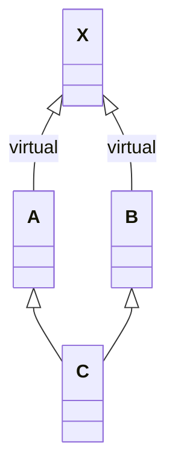

# 写在前面


# 默认构造函数

## 编译器生成非平凡默认构造函数的四种情况

1.   带有默认构造函数的成员类对象
2.   带有默认构造函数的基类
3.   带有一个虚函数的类
4.   带有一个虚基类的类

下面会分析四种情况

## 带有默认构造函数的成员类对象

```cpp
class Foo {
public:
    Foo() {
        printf("%s\n", __func__);
    }
};

class Bar {
public:
    // 生成默认构造
    Foo foo;   // 将 Bar::foo 初始化是编译器的责任
    char *str; // str初始化要让程序员来做
};

// 可能的实现
// inline Bar::Bar() { foo.Foo::Foo(); }

void t1() {
    using namespace case_1;
    Bar bar;
    // Foo
    // printf("bar.str=%s\n", bar.str); // !危险的内存访问
}
```


## 带有默认构造函数的基类

```cpp
class A {
public:
    A() {
        printf("%s\n", __func__);
    }
};

class B : public A {
    // no default ctor
};

void t2() {
    B b; // A
}
```


## 带有虚函数的类


```cpp
class W {
public:
    virtual void flip() const = 0;
    W() {
        printf("%s\n", __func__);
    }
};
class Bell : public W {
    void flip() const {}
};
class Whistle : public W {
    void flip() const {}
};

void flip(const W &w) {
    w.flip();
}

void t3() {
    Bell b;
    Whistle w;
    flip(b);
    flip(w);
    // W
    // W
}
```


## 派生自虚基类的类

```cpp
class X {
public:
    X() {
        printf("%s\n", __FUNCTION__);
    }
    int i;
};

class A : public virtual X {
public:
    int j;
};

class B : public virtual X {
public:
    int d;
};

class C : public A, public B {
public:
    int k;
};

void foo(A *pa) {
    pa->i = 1024;
}

void t4() {
    A *pa = new C; // X
    C *pc = new C; // X
    foo(pa);
    foo(pc);
    cout << pa->i << endl; // 1024
    cout << pc->i << endl; // 1024
}
```



## 总结

四种情况会造成编译器必须为未声明构造函数的类合成默认构造函数

>   被合成的默认构造函数称为: 隐式非平凡默认构造函数

这种被合成出来的构造函数, 只有基类子对象和成员类对象会被初始化, 其他非静态数据类型都不会被初始化. 


# 拷贝构造函数


# 初始化列表(initializer_list)


## 数据成员的初始化顺序

下面这段代码就说明了

**初始化列表中的项目顺序是由类中的成员声明顺序决定的**, 而**不是由初始化列表的排列顺序决定的**. 

```cpp
class X {
public:
    int i;
    int j;
    X(int val) : j(val), i(j) {}
    // clang++: 
    // warning: field 'j' will be initialized after field 'i' [-Wreorder-ctor]
    // warning: field 'j' is uninitialized when used here [-Wuninitialized]
};

void t1() {
    X x(21);
    cout << x.i << endl; // 1, this is default val
    cout << x.j << endl; // 21
}
```

当然, 上面这段代码修改之后就可以用了:

```cpp
class Y {
public:
    int i;
    int j;
    Y(int val) : j(val) { i = j; }
};

void t2() {
    Y y(21);
    cout << y.i << endl; // 21
    cout << y.j << endl; // 21
}
```

这段代码能通过编译是因为初始化列表中的成员先进行初始化, 然后才进入构造函数内部, 所以 i 的初始化并不会因为 j 还未初始化而受到影响. 


## 在初始化列表中使用成员函数 

>   可以但是最好别这样做, 因为成员函数可能和类的对象之间存在一定的依赖性. (可能存在多个对象, 这时候初始化列表并不知道用的是谁的成员函数来初始化成员)
>
>   最好使用: "存在于构造函数体内的一个成员" 而不是 "存在于成员的初始化列表中的成员" 来初始化一个数据成员

```cpp
class X {
public:
    int i;
    int j;
    X(int val) : i(xfoo(val)), j(val) {}
    int xfoo(int val) { return 1 + val; }
};


void t1() {
    X x(1);
    cout << x.i << endl; // 2
    cout << x.j << endl; // 1
}
```

上面 的例子没有问题, 但是改成这样的话就不行了:

```cpp
class X {
public:
    int i;
    int j;
    X(int val) : i(xfoo(val)), j(val) {}
    int xfoo(int val) { return i + val; } // 这里用类的数据成员来初始化, 会出现未定义值
};


void t1() {
    X x(1);
    cout << x.i << endl; // 1867950537
    cout << x.j << endl; // 1
}
```

### 继承的情况

```cpp
class Y : public X {
public:
    int _fval;

    int fval() { return _fval; }
    Y(int val) : _fval(val), X(fval()) {}
    // warning: field '_fval' will be initialized after base 'X'
    // [-Wreorder-ctor]
};

void t2() {
    Y y(2);
    cout << y._fval << endl; // 2
}
```

