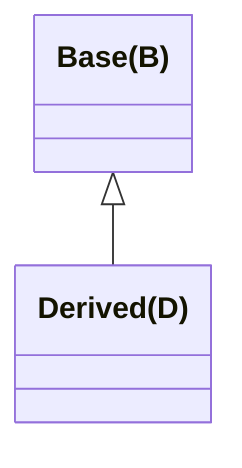

# 写在前面

写一下访问控制部分的总结, 内容来自 C++Primer5ed. 加上了一点自己的理解和例子, 方便大家学习. 

文中的例子都在 clang++ 16 (MacOS13.4 arm64) 下运行测试通过. 

# 总览

## 总体认知

-   public: 能被所有用户 (类内成员 / 对象 / 友元) 访问
-   protected: 能被 派生类成员 / 友元 访问
-   private: 能被 类内成员 / 友元 访问

这里最不好理解的就是 protected 级别, 因为这个级别既像 public(在派生类中)又像 private(在类的实例对象中). 

## 具体认知: protected


1.   和私有成员类似, 受保护成员对类的用户(对象)来说不可访问
2.   和公有成员类似, 受保护的成员对于派生类的成员和友元来说可访问
3.   $\bigstar$ 派生类的成员或者友元**只能通过派生类对象**来访问基类的受保护成员, 派生类对于一个**基类的实例对象中的受保护成员**没有任何访问权限 (不能越级访问).

第三条的一个例子:

```cpp
class Base { 
protected:
    int prot_mem;
};

class Sneaky : public Base {
    friend void f1(Sneaky&); // 可以访问 Sneaky::prot_mem
    friend void f2(Base&);   // 不可访问 Base::prot_mem
    int g() { return prot_mem; } //可以直接访问
    // int h() {
    //     Base b;
    //     return b.prot_mem; // 不能通过基类对象来获取其 protected 成员
    // }

    int j; // 默认: private
};

void t1() {
    Base b;
    // cout << b.prot_mem; // Error
}

void f1(Sneaky& s) { s.j = s.prot_mem = 0; }
// void f2(Base& b) { b.prot_mem = 0; } // protected, 不可访问

```

至于为什么要有这样一条规则, 其原因是:

如果派生类及其友元能访问基类对象的受保护成员, 则上面参数为基类引用的函数 f2 将是合法的, 即使这个函数不是基类的友元, 却可以访问(甚至改变) 基类的受保护成员, 会造成访问级别提供的成员保护失效. 

于是有了第三条规则:
派生类的成员和派生类的友元只能访问派生类对象中的基类部分的受保护成员, 对于普通的基类对象中的成员不具有特殊的访问权限. 

## 小结

protected 成员展现了两种特性

-   私有性: 针对用户(实例对象)
-   公有性: 针对**类内成员** / 友元


# 默认访问级别

这部分内容还是比较好理解的, 因为 struct 作为 C 时代的产物被保留下来(兼容), 其设计本来就是可以访问内部全部成员的. 而 class 为了体现访问控制, 默认就是以最高级别(private)作为成员访问级别的(友元是一种妥协)

至于继承保护级别, 自然也就传承下来了. 可以这样条件反射了: class<->private, struct<->public. 

|          | 成员访问级别 | 继承保护级别 |
| :------: | :----------: | :----------: |
| `struct` |   `public`   |   `public`   |
| `class`  |  `private`   |  `private`   |

>   1.   成员: 数据成员和成员函数

例子:

```cpp
// 下面两个语句等价, 但是为了清楚, 最好加上 private 关键字
class Derived : Base {};
class Derived : private Base {};

// 下面两个语句等价, 但是为了清楚, 最好加上 public 关键字, 事实上 struct 最好不要和 class 混用
struct Derived : Base {};
struct Derived : public Base {};
```

## 总结

1.   出于统一编程风格的考虑，当我们希望定义的类的所有成员是public 的时，使用 struct:反之，如果希望成员是private 的，使用class
2.   使用class和struct 定义类唯一的区別就是**默认的访问权限**(以及默认的继承访问级别)


# 继承下的访问控制

下面这部分是重头戏了, 因为继承本来就是 OO 设计的精髓. 

>   某个类对其继承来的成员的访问权限 受到两个因素的影响:
>
>   1.   在基类中该成员的访问说明符
>   2.   在派生类的派生列表中的访问说明符

## 类内成员的访问:成员访问说明符

还是以一个例子入手:

```cpp
class Base { // 基类
public:
    void pub_mem();

protected:
    int prot_mem;

private: // 基类中成员的访问说明符
    char priv_mem;
};
```

下面是三种继承保护级别的派生类:

```cpp
struct Pub_Derv : public Base {
    int f() { return prot_mem; } // 派生类可以访问 protected 成员
    // char g() { return priv_mem; } // 不可访问 private 成员
    void h() { pub_mem(); } // ok
};

struct Prot_Derv : protected Base {
    // '受保护继承'使得 Base 的所有公有成员在本类中都是受保护的
    int f2() const { return prot_mem; }
    // chr g() { return priv_mem; } // 不可访问 private 成员
    void h() { pub_mem(); } // ok
};

struct Priv_Derv : private Base {
    int f() const { return prot_mem; }
    // char g() { return priv_mem; } // 不可访问 private 成员
    void h() { pub_mem(); } // ok
};
```

由此可以做一个表格: (很好记)

<center>派生类中继承来的基类数据成员在<b>派生类内</b>的访问权限</center>

| 成员`\`继承 | public | protected | private |
| :---------: | :----: | :-------: | :-----: |
|  `public`   |   ✔️    |     ✔️     |    ✔️    |
| `protected` |   ✔️    |     ✔️     |    ✔️    |
|  `private`  |   ❌    |     ❌     |    ❌    |

>   -   成员: 基类成员的访问说明符(成员访问级别), 
>   -   继承: 派生类的派生列表中的访问说明符(继承保护级别), 
>
>   ```cpp
>   class P : public /* 继承保护级别 */  B { 
>   private: // 成员访问级别
>       int x;
>   };
>   ```


由此可得出一些结论:

1.   派生访问说明符对于派生类的成员(以及友元)能否访问其**直接基类**的成员没有影响
2.   对基类成员的访问权限只与基类中的**成员访问说明符**有关


## 用户(实例对象)的访问: 通过派生列表访问说明符

接着看这个例子, 类的实例对象对基类/派生类成员的访问情况:

```cpp
void test1() {
    Pub_Derv d1;
    d1.pub_mem(); // 可以访问
    Priv_Derv d2;
    // d2.pub_mem(); // private, 不能访问
    Prot_Derv d3;
    // d3.pub_mem(); // protected, 不能访问, 保护展现私有性
}
```

并且, 对于继承自上述派生类的新类, 有:

```cpp
struct Derived_from_Public : public Pub_Derv {
    // ok, Base::prot_mem 在 Pub_Derv 中仍然是 protected 的
    int use_base() { return prot_mem; }
};

struct Derived_from_Protected : public Prot_Derv {
    // ok, Base::prot_mem 在 Pub_Derv 中仍然是 protected 的
    int use_base() { return prot_mem; }
};

struct Derived_from_Private : public Priv_Derv {
    // error, Base::prot_mem 在 Priv_Derv 中是 private 的
    // int use_base() { return prot_mem; }
};

```

于是, 我们可以知道:

1.   派生访问说明符的目的是控制派生类用户(对象, 或派生类的派生类)对基类成员的访问权限
2.   派生访问说明符还可以控制继承自派生类的新类的访问权限
3.   对采用受保护继承的派生类`Prot_Derv`来说, 基类 Base 的所有公有成员在该类中都是受保护的, 所以一个派生自`Prot_Derv`的类`Derived_from_Protected`可以访问`Base::prot_mem`. 而`Prot_Derv`的用户不能访问`Base::pub_mem`(因为受保护继承的私有性)

接着制表

<center>派生类中继承来的基类数据成员在<b>派生类的实例对象</b>中的访问权限</center>

| 成员`\`继承 | public | protected | private |
| :---------: | :----: | :-------: | :-----: |
|  `public`   |   ✔️    |     ❌     |    ❌    |
| `protected` |   ❌    |     ❌     |    ❌    |
|  `private`  |   ❌    |     ❌     |    ❌    |

>   很好理解吧, 实例对象只对公有成员可访问, 而使用了受保护继承和私有继承修改了派生类中这部分成员的访问权限, 导致即使是基类中的公有成员也不能被实例对象访问. 

<center>派生类中继承来的基类数据成员在<b>派生类的派生类</b>中的访问权限</center>

| 成员`\`继承 | public | protected | private |
| :---------: | :----: | :-------: | :-----: |
|  `public`   |   ✔️    |     ✔️     |    ❌    |
| `protected` |   ✔️    |     ✔️     |    ❌    |
|  `private`  |   ❌    |     ❌     |    ❌    |

>   注: 这里派生类的派生类指的都是通过 public 继承得来的派生类. 


## 小结

>   不考虑继承时, 类有两种用户, 普通用户(私有, 对象)和类的实现者(公有, 成员)
>
>   -   普通用户编写的代码使用类的对象, 这部分代码只能访问类的公有接口成员
>   -   实现者负责编写类的成员和友元的代码, 使得成员和友元既能访问类的公有部分, 也能访问类的私有(实现)部分.
>
>   ---
>
>   考虑继承时, 会出现第三种用户, 即派生类. 
>
>   基类把它希望派生类能使用的部分声明为受保护的, 此时普通用户(实例对象)不能访问受保护的成员, 而派生类及其友元仍不能访问私有成员. 
>
>   ---
>
>   基类应将其接口成员声明为公有, 同时将属于其实现的部分分成两组, 
>
>   -   一组可供派生类访问(受保护的), 使派生类在实现自己功能的同时使用基类的操作(成员函数)和数据(数据成员). 
>   -   一组只能由基类及基类的友元访问(私有的). 

我的理解: 

1.   成员访问说明符控制**派生类对基类成员的访问权限** (强调派生类自己访问基类成员)

2.   派生访问说明符控制**派生类中基类成员的被访问级别** (强调其他类/对象访问基类成员)

     >    这里的**其他类**可以是继承自派生类的新类, **其他对象**可以是派生类自己的对象或者派生类的派生类的对象. 


一个误区:

我一开始以为私有继承/受保护继承都是让派生类不能访问基类的成员, 事实上这个只是由基类的成员访问级别控制的, 继承级别控制的是派生类本身成员的访问控制级别, 影响的是派生类的对象和派生类的派生类...

## 类型转换对访问级别的影响

**派生类向基类**转换是否可访问, 由使用该转换的代码决定, 同时派生类的派生访问说明符也会有影响. 

例子:



规则:

-   实例对象层面(用户代码): 只有当 D 公有继承 B 时, 才能使用派生类向基类的转换, 私有和受保护不能使用该转换
-   派生类内: 不管 D 以什么方式继承 B, D 的成员函数和友元都能使用派生类向基类转换, **派生类向其直接基类的类型转换对于派生类的成员和友元来说永远都是可以访问的** 
-   派生类的派生类内: 如果 D 继承 B 的方式是公有或受保护, 则 D 的派生类的成员和友元可以用 D->B 的类型转换; 如果私有, 则不能使用

## 特定成员访问级别的修改

通过 using 实现:

```cpp
class Base {
public:
    std::size_t size() const { return n; }

protected:
    std::size_t n;

private:
    int x;
};

class Derived : private Base {
public:
    using Base::size; // 这样可以保持对象 size 成员的访问级别
    // using Base::x; // 由于派生类访问不到基类私有成员 x, 所以 using 无效

protected:
    using Base::n;
};
// 加上 using 之后, Derived 的对象可以使用 size()
// 而其派生类可以使用保护对象 n

class P : public Derived {
    size_t f() { return n; } /// ok , by `using`
};

void t1() {
    Derived d;
    std::cout << d.size(); /// ok , by `using`
}

```

总结:

1.   派生类只能为那些它可以访问的名字提供 using 声明
2.   using 声明语句中名字的访问权限由该 using 声明语句之前的访问说明符来决定


# 含有友元的继承

友元关系不可传递, 也不能继承. 

>   不可传递指的是: 一个在类内声明了友元类的类, 就算这个友元类声明了其他友元类, 其他友元类内的成员也不能通过该友元类访问该类的私有成员. 

```cpp
class Base {
    friend class Pal; // 友元

protected:
    int prot_mem;
};

class Sneaky : public Base {
private:
    int g() { return prot_mem; }
    int j; // private
};

class Pal {
public:
    int f1(Base b) { return b.prot_mem; } // ok, Pal is a friend of Base
    // Pal 不是 Sneaky 的友元
    // int f2(Sneaky s) { return s.j; } // private, 不可访问
    // 友元可以访问受保护和私有的成员, 此时 Base 是 Sneaky 中的一部分
    int f3(Sneaky s) { return s.prot_mem; } // ok, Pal is a friend of Base
};

class D2 : public Pal {
public:
    // int mem(Base b) { return b.prot_mem; } // 友元关系不能继承
    // 每个类都负责控制各自成员的访问权限
};
```

总结:

1.   友元关系不可继承, 不可传递

2.   每个类都控制自己成员的访问权限, 即使对派生类中的基类部分也是如此(保证了上述 f3 的正确性)

     所以, 派生类的友元不能访问基类的私有成员

3.   当一个类将另一个类声明为友元类, 这种友元关系只对作出声明的类有效, 对于原来的类, 其友元的基类或者派生类都不具有特殊访问能力. 


# 最后的总结

1.   每个类分别控制自己成员的初始化过程(通过成员访问说明符),  每个类还分别控制着其成员对于派生类来说是否可访问(通过派生列表的访问说明符). 
2.   protected 访问权限针对用户(实例对象)体现私有性(不可访问), 针对派生类体现公有性(可访问), 针对派生类中的基类对象体现私有性(如果可访问, 那么基类的受保护成员将不再受保护)
