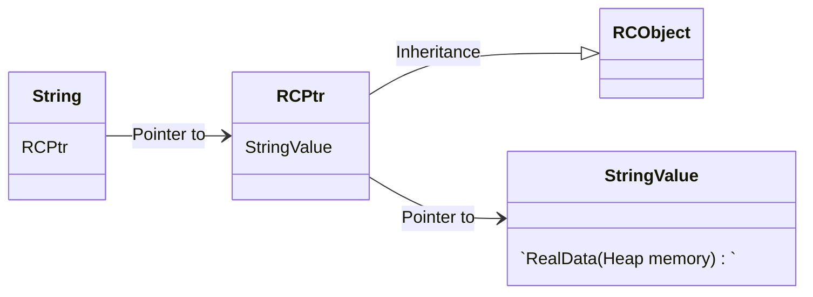
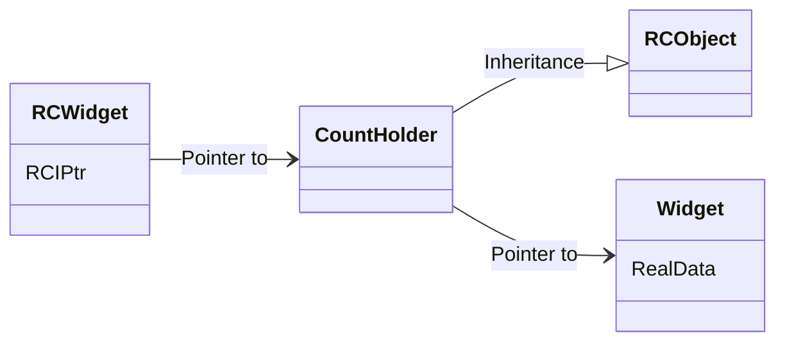

# 写在前面

参考了 More Effective C++ Item28/29, 非常经典的一个条款,  把引用计数方法的实现完整呈现出来, 细节也讲得非常细致. 

测试代码我写在一个文件里面了, 通过 namespace 分隔, 有兴趣的同学可以看这里:

[Effective-Cpp-All/more-effective-c++/Techniques_Idioms_Patterns/item29_Reference_Counting.cpp at main · zorchp/Effective-Cpp-All · GitHub](https://github.com/zorchp/Effective-Cpp-All/blob/main/more-effective-c%2B%2B/Techniques_Idioms_Patterns/item29_Reference_Counting.cpp);

# 技巧/准则


1.   struct 嵌套于 class的 private 段落内, 可以很方便地让该 class 的所有成员有权处理这个 struct, 而又能够禁止任何其他人访问这个 struct(除了 class 的 friend)
2.   如果类内数据成员含有指针, 一定要为其实现 copy-ctor 和 copy-assignment-operator. 如果不是, 编译器默认生成的这两个函数会仅仅拷贝指针而非其指向的实际内容(浅拷贝), 会导致内存访问等问题. 


# RAII 实现的智能指针模板

这是面试常考题目了, 

>   RAII本质上就是用构造函数创建对象(new), 析构函数释放内存(delete), 很多经典的操作都是成对出现, 这样就可以方便的使用 RAII 技术了, 例如互斥锁(lock_guard)和 fstream 操作()

## 基本功能

1.   构造和析构
2.   拷贝和赋值
3.   解引用和取用(`->`, `.`)


## 实现

>   参考了 More Effective C++ 的附录, auto_ptr 的实现. 有部分改动(复用`release()`方法). 

```cpp
template <class T>
class auto_ptr {
public:
    explicit auto_ptr(T *realPtr = nullptr) : pointee(realPtr) {}
    auto_ptr(auto_ptr<T> &rhs) : pointee(rhs.release()) {}
    ~auto_ptr() {
        delete pointee;
    }

    auto_ptr &operator=(auto_ptr<T> &rhs) {
        if (this == &rhs)
            return *this;
        delete pointee;
        pointee = rhs.release();
        return *this;
    }
    T *operator->() const {
        return pointee;
    }
    T &operator*() const {
        return *pointee;
    }
    T *get() const {
        return pointee;
    }

    T *release() { // 转换为普通指针
        T *oldPtr = pointee;
        pointee = nullptr;
        return oldPtr;
    }
    void reset(T *p = nullptr) { // 重置为空指针
        if (pointee != p) {
            delete pointee;
            pointee = p;
        }
    }

private:
    T *pointee;
};
```

## 需要注意的点

1.   构造函数声明为`explicit`, 可以避免隐式类型转换带来的问题
2.   拷贝构造函数和拷贝赋值运算符的参数都不是`const`的, 否则会使得针对源对象(rhs)的赋值失败
3.   在析构函数中释放内存: `delete pointee;` 
4.   需要重载指针的两个操作符`.`和`->`, 以便用户能像使用裸指针那样使用智能指针

## 使用方法

```cpp
class P {
public:
    P() {
        printf("%s\n", __FUNCTION__);
    }
    void f() { //
        printf("%s\n", __FUNCTION__);
    }
    ~P() {
        printf("%s\n", __FUNCTION__);
    }
};

void t1() {
    auto p = SmartPtr<P>(new P); // P
    p->f();                      // f
    auto q = SmartPtr<P>(new P); // P
    q = p;                       //~P
    q->f();                      // f
    auto r = q.release(); // r 此时为普通指针, 需要手动释放内存
    r->f();   // f
    delete r; //~P
}

void t2() {
    //
    auto p = auto_ptr<P>(new P); // P
    p->f();                      // f
    auto q(p);
} //~P
```

## 缺点

1. 不能放入容器或者以传值调用方式使用(必须用引用), 因为值传递(拷贝构造)会导致指针失效, 因为拷贝构造和拷贝赋值都会转移对象所有权, 也即一个对象只能被一个智能指针拥有. 
1. 不支持动态数组的释放, 需要额外通过`delete[]`管理. 

### 例子: 传值调用

```cpp
void print(std::ostream &s, auto_ptr<P> p) {
    s << (*p).val << '\n';
}
void t3() {
    // 由于拷贝构造函数会转移对象的所有权, 所以如果传值会出现资源泄露
    auto_ptr<P> p(new P);
    p->val = 10;
    print(std::cout, p); // 值传递
    // 此时 p 为空指针了
    // assert(p.release() != nullptr);
    p->val = 10; // runtime error: member access within null pointer of type 'P'
}

void print1(std::ostream &s, const auto_ptr<P> &p) {
    s << (*p).val << '\n';
}
void t4() {
    // 使用常引用就可以了
    auto_ptr<P> p(new P);
    p->val = 10;
    print1(std::cout, p);
    p->val = 12;
    print1(std::cout, p);
} //~P
```

至于容器, 因为 C++新标准加入的右值引用, 导致push_back 实际上会去找移动构造版本, 这样也就不会出现问题了. 


## 与 unique_ptr 的区别

在 unique_ptr 实现中, 删除(`=delete`)了拷贝构造函数和拷贝赋值运算符, 并且采用移动构造等方法来完成所有权的转移. 

使得 unique_ptr 可以放入容器, 

并且, unique_ptr有两个版本，第一个版本是默认的管理单个对象的版本，第二个版本是通过偏特化实现的管理动态分配的数组的版本

# 引用计数

## 简介

引用计数(Reference Counting, RC), 允许多个等值对象共享同一份实值, 此技术的发展有两个动机:

1.   简化堆对象周边的簿记工作(类似智能指针, auto_ptr 每个对象有且仅能有一份)
2.   针对许多具有同一份值的对象只存储一份, 多个等值对象共享一份实值(读时共享, 写时复制 COW)


## 规则

1.   默认引用计数为 0

2.   默认/含参构造函数使当前对象引用计数+1

3.   拷贝构造函数使当前对象引用计数+1

4.   拷贝赋值运算符递减左侧指针所指对象的引用计数, 递增右侧指针所指对象对象的引用计数

     >   可以这样理解: `s1 = s2;` 等价于`s1.operator=(s2);` 下面分别用 `this` 和 `rhs` 代表 `s1` 和 `s2` 
     >
     >   s1 和 s2 此时指向同一份对象(`rhs`的对象), 该对象的引用计数应该+1, 即`++s2.val`, 
     >
     >   而s1 在这个赋值动作执行之前所指的那个对象(`this`)的引用计数应该-1, 因为 s1 已经不在指向那个对象了.

5.   如果对象的引用计数为 0, 析构函数释放内存

6.   只有在需要修改一份实值的时候, 例如下标操作符`operator[]`改动字符串时候才复制一份新的字符串对象(COW)

     >   这里是一个细节, 实现两个版本, const 和 non-const 的 `operator[]` 


## 第一种情况: 直接实现(以字符串类为例)

### 基类: 实现引用计数核心功能

```cpp
class RCObject {
public:
    RCObject() : refCount(0), shareable(true) {}
    RCObject(const RCObject &) : refCount(0), shareable(true) {}
    RCObject &operator=(const RCObject &) {
        return *this;
    }
    virtual ~RCObject() = 0; // 只能被用作基类

    void addReference() {
        ++refCount;
    }
    void removeReference() {
        if (--refCount == 0)
            delete this;
    }
    void markUnshareable() { // 标记为不可共享
        shareable = false;
    }
    bool isShareable() const { // 是否可共享
        return shareable;
    }
    bool isShared() const { // 是否正在被共享
        return refCount > 1;
    }

private:
    int refCount;   // 引用计数值
    bool shareable; // 对象是否可共享
};

RCObject::~RCObject() {} // 必须实现
```

注意, 这里还用了一个成员`shareable`表示指针所指对象是否可共享, 如果可共享就直接使用原对象, 否则还需要重新 new 一份新的对象出来. 

### 引用计数智能指针

```cpp
// 自动完成引用计数, "T必须继承自RCObject", 以使用引用计数的功能
template <class T>
class RCPtr { // 智能指针实现
public:
    RCPtr(T *realPtr = nullptr) : pointee(realPtr) {
        int_cnt();
    }
    RCPtr(const RCPtr &rhs) : pointee(rhs.pointee) {
        // 当 String 发生拷贝初始化, 调用智能指针的拷贝构造函数
        int_cnt();
    }
    ~RCPtr() {
        if (pointee) {
            pointee->removeReference();
        }
    }

    RCPtr &operator=(const RCPtr &rhs) { // COW call this
        if (pointee != rhs.pointee) { // 判断自赋值
            if (pointee)
                pointee->removeReference();
            pointee = rhs.pointee;
            int_cnt();
        }
        return *this;
    }

    T *operator->() const {
        return pointee;
    }
    T &operator*() const {
        return *pointee;
    }

private:
    T *pointee;
    void inc_cnt() {
        if (pointee == nullptr)
            return;
        if (pointee->isShareable() == false) // 不可共享, 创建一份新的
            pointee = new T(*pointee);
        pointee->addReference(); // 默认值是 0, 这里初始化就要先+1
    }
};
```

在使用这个类模板的时候, 类型 T 一定是要继承自`RCObject`的, 否则一些基本功能无法实现. 

这个智能指针的核心就是 inc_cnt() 函数, 用于判断指针属性和增加引用计数, 成员函数的实现都是基于引用计数的基本规则的, 例如拷贝赋值运算符就是先递减 this 的引用计数然后增加 rhs 的引用计数. 

### 字符串类

对于字符串的实现, 就很顺理成章了, 因为引用计数已经被封装好. 

```cpp
class String {
public:
    String(const char *initValue = "") : value(new StringValue(initValue)) {}

    const char &operator[](int index) const { // 直接取出值
        return value->data[index];
    }

    char &operator[](int index) { // COW, 如果可共享, 拷贝新值
        if (value->isShared()) {
            value = new StringValue(value->data);
        }
        value->markUnshareable(); // 标记为不可共享, 此时才可以执行写时复制
        return value->data[index];
    }

    // for test
    void printf_data() {
        printf("%s\n", value->data);
    }
    void printf_data_address() {
        printf("%p\n", value->data);
    }

private:
    struct StringValue : public RCObject { // T 继承自 RCObject
        char *data;
        void init(const char *initValue) {
            data = new char[strlen(initValue) + 1];
            strcpy(data, initValue);
        }

        StringValue(const StringValue &rhs) {
            init(rhs.data);
        }
        StringValue(const char *initValue) {
            init(initValue); // deep copy
        }
        ~StringValue() {
            delete[] data;
        }
    };
    RCPtr<StringValue> value; // 接管堆区数据
};
```

这里并没有声明 String 类的拷贝构造和拷贝赋值, 因为编译器会帮我们实现, 并且会调用基类(这里就是数据实际的接管者 RCPtr类)的这部分内容

主要需要注意的是这里给出的两份`operator[]`实现, const 用于仅返回值, 而引用版本还要能够修改值, 修改值通过写时复制技术仅在对象不可共享情况下才会完成, 所以第 13 行的标记十分重要. 


### 类图

这里用 mermaid 画了一下, 感觉还是不太美观...(可以看书上的原图)



总之还是很清晰的, 但是美中不足的一点就是没办法让现有的类直接使用, 只能在类实现的时候写入引用计数功能, 并且还要对实际数据封装, 显得比较麻烦. 

这就有了第二种情况..

## 第二种情况: 为现有的类实现

引用计数基类同上`RCObject`, 这里不多说了. 

### 间接实现引用计数类

```cpp
template <class T>
class RCIPtr {
public:
    RCIPtr(T *realPtr = nullptr) : counter(new CountHolder) {
        counter->pointee = realPtr;
        inc_cnt();
    }

    RCIPtr(const RCIPtr &rhs) : counter(rhs.counter) {
        inc_cnt();
    }

    ~RCIPtr() {
        counter->removeReference();
    }
    RCIPtr &operator=(const RCIPtr &rhs) {
        if (counter != rhs.counter) {
            counter->removeReference();
            counter = rhs.counter;
            inc_cnt();
        }
        return *this;
    }

    const T *operator->() const {
        return counter->pointee;
    }
    T *operator->() {
        makeCopy(); // COW
        return counter->pointee;
    }

    const T &operator*() const {
        return *(counter->pointee);
    }
    T &operator*() {
        makeCopy(); // COW
        return *(counter->pointee);
    }

private:
    struct CountHolder : public RCObject { // 管理实际数据
        ~CountHolder() { // 实现虚析构
            delete pointee;
        }
        T *pointee;
    };
    CountHolder *counter;
    void inc_cnt() { // 用于增加引用计数
        if (counter->isShareable() == false) {
            T *oldValue = counter->pointee;
            counter = new CountHolder;
            counter->pointee = new T(*oldValue);
        }
        counter->addReference();
    }
    void makeCopy() { // 用于写时复制
        if (counter->isShared()) {
            T *oldValue = counter->pointee;
            counter->removeReference();
            counter = new CountHolder;
            counter->pointee = new T(*oldValue);
            counter->addReference();
        }
    }
};
```

总体思路还是延续了前面引用计数的基本规则, 

>   这其实就是一个带引用计数的智能指针了, 并且还加上了 COW 技术, 用起来非常方便. 

### 测试

```cpp
class P {
public:
    P() {
        printf("%s\n", __FUNCTION__);
    }
    void f() { //
        printf("%s\n", __FUNCTION__);
    }
    ~P() {
        printf("%s\n", __FUNCTION__);
    }
    int val;
};

void t5() {
    RCIPtr<P> p(new P); // p: 0->1
    auto q(p);          // q: 0->1->2, p: 1->2
    RCIPtr<P> r(new P); // r: 0->1
    r = q;              // r: 1->0, q: 2->3
} // 3->0, 这里用到了 RAII, 比较巧妙
```

完整输出的函数调用情况如下: (用`__func__`宏)

```c
// RCIPtr<P> p(new P);
P
RCIPtr
inc, now cnt=1 // p 所指对象引用计数+1

// auto q(p); // 注意这里并没有调用 P 的构造函数, 说明仅仅复制了指针
RCIPtr
inc, now cnt=2 // p, q 所指对象引用计数+1
               // 注意这里 q 的引用计数第一次增加是在构造函数中, 第二次是在拷贝构造中

// RCIPtr<P> r(new P);
P
RCIPtr
inc, now cnt=1 // r 的引用计数+1

// r = q;
dec, now cnt=0 // 递减 r 的引用计数, 释放 r 所指的对象
~CountHolder
~P // 这里释放的是 r 所指的对象
~RCObject()
inc, now cnt=3 // q 的引用计数此时加到了 3

// }
~RCIPtr
~RCIPtr
~RCIPtr // RAII, 分配了三份智能指针, 这里都要析构掉
        // 析构函数中存在引用计数递减操作, 实现内存资源的自动管理
dec, now cnt=0
~CountHolder
~P // 这里释放一开始由 p 指向的对象
~RCObject()
```

上面一波分析之后就可以理解智能指针的运行原理了吧~

### 类图



## 总结

使用带有引用计数的智能指针以改善效率的最佳时机: 

1.   相对多数的对象共享相对少量的实值
2.   对象实值的产生或销毁成本很高, 或者使用内存较大


