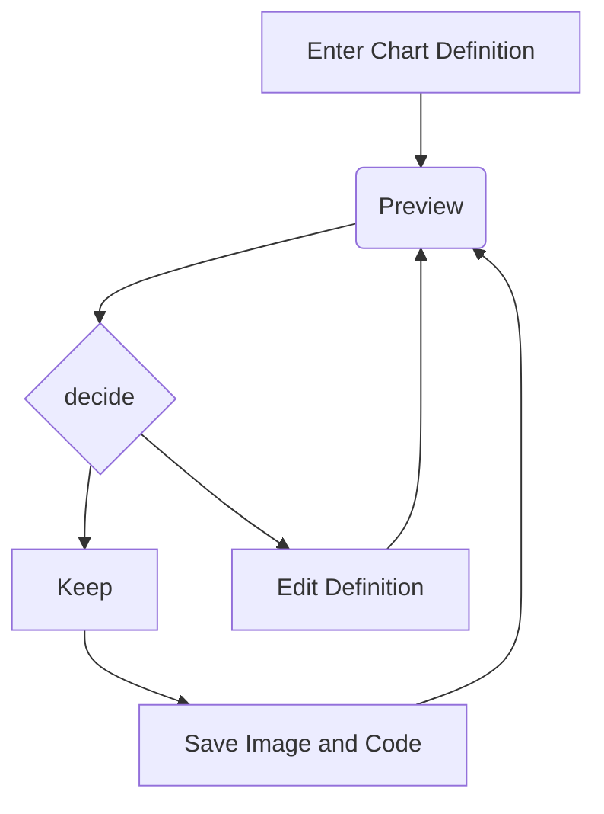

# 写在前面

最近忙里偷闲, 搞一下博客, 由于写一些笔记需要做时序图和类图, markdown 有现成的支持: mermaid-js, [网站](https://mermaid.js.org/), 这里就直接拿来主义了, 我的博客是基于 [jekyll-TeXt-theme](https://github.com/kitian616/jekyll-TeXt-theme) 的, 里面内置了 mermaid 开关, 但是版本已经比较老旧了, 下面来看看如何更新配置以及适配暗黑主题(如果用默认主题会导致线条显示对比度不明显). 


# 方法

## 开启支持

先改`_config.yml`文件: 

```yaml
## => Markdown Enhancements
##############################
## Mathjax
mathjax: true # false (default), true
mathjax_autoNumber: true # false (default), true

## Mermaid
mermaid: true # false (default), true

## Chart
chart: true # false (default), true
```


## 更新配置

这里看了 [issue](https://github.com/kitian616/jekyll-TeXt-theme/issues/354#issuecomment-1333615765), 给出的建议是修改 cdn 网站(其实就是一个分发缓存)

下面是我的更改: `_data/variables.yml`文件

```yaml
sources:
  - bootcdn:
    mermaid: 'https://cdn.jsdelivr.net/npm/mermaid/dist/mermaid.min.js' # 最新稳定版
    
  - unpkg:
    mermaid: 'https://unpkg.com/mermaid@10.2.0/dist/mermaid.min.js'
```

这部分内容完成之后, 其实在博客中写入:

````markdown

````

就会渲染出:


了, 这个例子摘录自官网的示例. 


但是主题并不是我想要的, 下面来看看如何改成黑色主题适配的样式.

# 暗黑主题适配


一开始我想的是遵循官网的例子, 加上下面的 js 代码:

```js
mermaidAPI.initialize({
  securityLevel: 'loose',
  theme: 'dark',
});
```

但是并不起作用, 后来发现原来是远程主题在作怪, 找到`/_includes/markdown-enhancements/mermaid.html` 文件然后做如下更改:



```html


<script>
  window.Lazyload.js('{{ _sources.mermaid }}', function() {
    mermaid.initialize({
      startOnLoad: true,
      securityLevel: 'loose', // add this
      theme: 'dark', // add this
    });
    mermaid.init(undefined, '.language-mermaid');
  }); 
</script>
```



然后刷新页面: 完美显示!


