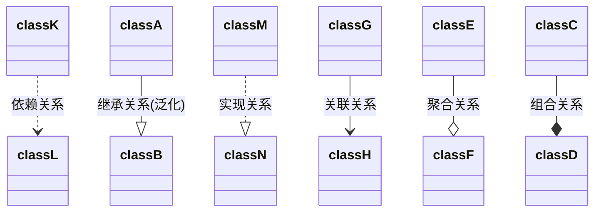
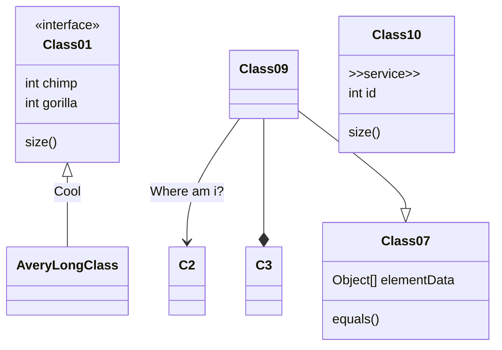

# 写在前面

```mermaid
classDiagram
classK ..> classL : 依赖关系
classA --|> classB : 继承关系(泛化)
classM ..|> classN : 实现关系
classG --> classH : 关联关系
classE --o classF : 聚合关系
classC --* classD : 组合关系
```

```mermaid
classDiagram
    Class01 <|-- AveryLongClass : Cool
    <<interface>> Class01
    Class09 --> C2 : Where am i?
    Class09 --* C3
    Class09 --|> Class07
    Class07 : equals()
    Class07 : Object[] elementData
    Class01 : size()
    Class01 : int chimp
    Class01 : int gorilla
    class Class10 {
        >>service>>
        int id
        size()
    }
```